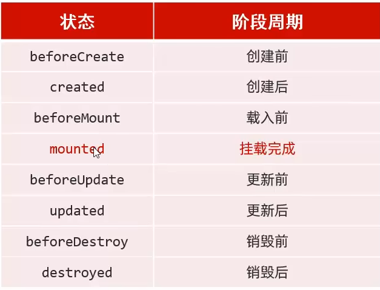

#### JSP
1. 原理：本质上是一个Servlet
2. 脚本：申明java代码方式
   1. \<%...%>:内容会直接放到_jspService()方法之中
   2. \<%=..%>:定义的java代码，会输出到页面上
   3. \<%!...%>∶定义的java代码，在jsp转换后的java类的成员位置。
   4. JSP的内置对象
      * 不需要创建，可以直接使用
      * 一共9个内置对象
        1. request
        2. response
        3. out：字符输出流
<br><br>

### Session
1. 概念：服务器会话技术，在一次会话中多次的请求间共享数据，数据保存在服务器端
2. 快速入门
   * 获取HttpSession对象
     1. HttpSession session = request.getSession();
   * 使用HttpSession对象
     1. Object getAttribute(String name);
     2. void setAttribute(String name,Object value);
     3. void removeAttribute(String name);
     
3. 原理
   * Session的实现是依赖于Cookie的。
4. 细节
   1. 当客户端关闭后，服务器不关闭，两次获取session是否同一个？
      * 默认情况下不是。
   2. 客户端不关闭，服务器关闭，两次获取的session是否同一个？
      * 不是同一个
   3. session的失效时间？
      1. 服务器关闭
      2. session调用invalidate()
      3. session默认失效时间30分钟
   4. 特点
      1. session用于存储一次会话的多次请求的数据，存在服务器端
      2. session可以存储任意类型，任意大小的数据
      * session与cookie的区别:
        1. session存储数据在服务器端，cookie在客户端
        2. session没有数据大小限制,cookie有
        3. session数据安全，cookie相对于不安全

#### 案例：验证码

### Filter
1. 访问服务器资源时，过滤器将请求拦截，完成一些特殊功能
   * 登录验证、统一编码处理、敏感字符
2. 快速入门
   * 步骤
      1. 定义一个类，实现接口Filter
      2. 复写方法
      3. 配置拦截路径
         1. web.xml
         2. 注解
   * 代码：
     ```
     @WebFilter("/*")//访问所有资源之前都会执行该过滤器
     public class FilterDemo1 implements Filter {
        @Override
         public void init(FilterConfig filterConfig) throws ServletException {
         }
        
         @Override
         public void doFilter(ServletRequest servletRequest, ServletResponse servletResponse, FilterChain filterChain) throws IOException, ServletException {
              System.out.println("filterDemo1被执行了");
              //放行
              filterChain.doFilter(servletRequest,servletResponse);
        }
     
        @Override
        public void destroy() {
        }
     }
     ```
3. 过滤器细节
   1. web.xml配置
      ```
      <filter>
         <filter-name>demo1</filter-name>
         <filter-class>com.twt.filter.FilterDemo1</filter-class>
      </filter>
      <filter-mapping>
         <filter-name>demo1</filter-name>
         <url-pattern>/*</url-pattern>
      </filter-mapping>
      ```
   2. 执行流程
   3. 生命周期方法
      * init:服务器启动后，会创建Filter对象，让后调用init，只一次。一般加载资源
      * destroy:服务器关闭后，调用destroy方法，只一次，一般释放资源
   4. 配置详解
      * 拦截路径
        1. 具体路径
        2. 拦截目录：/user/*,访问/user下所有资源时
        3. 后缀名拦截：*.jsp , 访问所有jsp资源时
        4. 拦截所有资源
      * 拦截方式配置
        1. 注解配置
           * @dispatcherTypes属性
             1. request：默认值
             2. forward：转发访问资源
             3. include：包含访问
             4. ERROR：错误跳转
             5. ASYNC：异步访问
        2. web.xml
   5. 过滤器链(配置多个过滤器)
  <br><br><br>
### Vue
1. 概念：vue是一套前端框架，免除Java原生JavaScript中的DOM操作
2. 快速入门
   ```
   <body>
    <div id="app">
        <input type="text" v-model="message">
        {{message}}
    </div>

    </body>
    <script>
    //定义Vue对象
    new Vue({
        el:"#app",//接管的区域
        data:{
            message:"hello"
        }
    })

   </script>
   ```
    * el:接管的区域
   
3. 常用指令：标签中带有v-前缀的特殊属性
   * v-bind:为html标签绑定属性值，如设置href、css样式
   * v-model：在表单元素上创建双向数据绑定
   * v-on:为html标签绑定事件
   * v-if、v-else-if、v-else:条件性的渲染某元素，判定为true时渲染
   * v-show:根据条件展示某元素，区别在于切换的是display属性的值
   * v-for：列表渲染，遍历容器元素或者对象属性
     * 使用：
       ```
       <div v-for="addr in addrs">{{addr}}</div>
       //addrs是需要遍历的数组，addr是遍历的数据
       <div v-for="(addr,index) in addrs">{{index+1}}:{{addr}}</div>
       //addr遍历的结果、index是下标，从0开始
       ```
4. Vue生命周期：从创建到销毁的整个过程
   * 生命周期的八个阶段:每触发一个生命周期事件，会自动执行一个生命周期方法(钩子)。
   * 
   * 主要学习mounted：mounted(){console.log("挂载完成，发送请求数据")}

<br><br><br>
### Ajax 
1. 概念：异步的Javas和xml
2. 作用：
   * 数据交换：通过Ajax可以给服务器发送请求，并获取服务器响应的数据。
   * 异步交互：可以在不重新加载整个页面的情况下，与服务器交换数据并更新部分网页的技术，如:搜索联想、用户名是否可用的校验等等。
3. 步骤
   1. 创建XMLHttpRequest对象：用于和服务器交换数据
   2. 向服务器发送请求
   3. 获取服务器响应数据

#### Axios:封装了Ajax原生方式
1. 步骤
   1. 引入Axios的js文件
   2. 使用Axios发送请求，并获取响应结果
      ```
       axios({
          method: "get",
          url: "http://yapi.smart-xwork.
          n/mock/169327/emp/list"
       }).then((result) =>{
          console.log(result.data);});
      ```